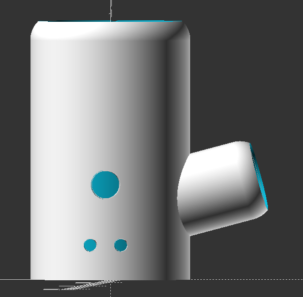
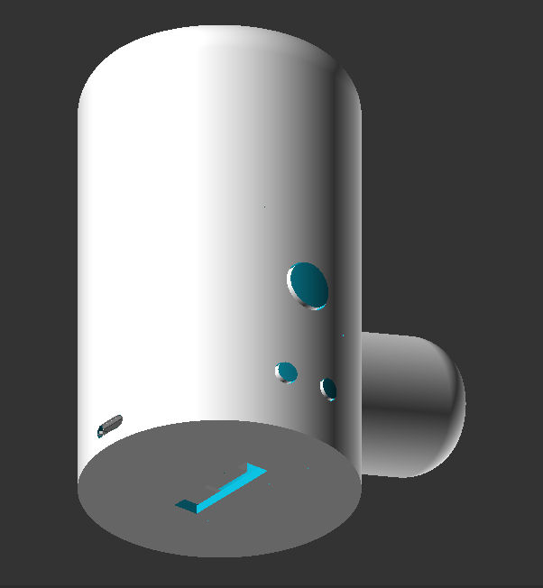

# Pipe Mod
### A 3D Printed Pipe Mod for the DNA60 Chipset from Evolv

This repository will contain the OpenSCAD files as well as STL/AMF exports of the parts needed to actually print the mod yourself.

My focus was on keeping the number of parts down while keeping the outside of the mod as clean as possible.

Currently you only need to print 6 files.

- [The Main Body](Completed_Files/pipemod.stl)
- [The Fire Button](Completed_Files/fire_button.stl)
- [The Up & Down Buttons](Completed_Files/up_down_button.stl)
- [The Pipe Cap](Completed_Files/pipe_cap.stl)
- [The Battery Sled](Completed_Files/battery_sled.stl)
- [The DNA60 Board Holder](Completed_Files/DNA60_mount.stl)

You will find these files in the [Completed Files](Completed_Files) directory.

#### Parts list:
1.  [Evolv DNA60 Large Screen ( With USB Charge Board )](https://www.evolvapor.com/products/dna60)
2.  [Keystone Part #1017-1 ( Positive Battery Contact )](https://www.keyelco.com/product.cfm/product_id/4043/)
3.  [Keystone Part #5223 ( Negative Battery Contact )](https://www.keyelco.com/product.cfm/product_id/910/)
4.  [Red 16awg Silicone Wire](https://hobbyking.com/en_us/turnigy-high-quality-16awg-silicone-wire-1m-red.html)
5.  [Black 16awg Silicone Wire](https://hobbyking.com/en_us/turnigy-high-quality-16awg-silicone-wire-1m-black.html)
6.  [Red 24awg Silicone Wire](https://hobbyking.com/en_us/turnigy-high-quality-24awg-silicone-wire-1m-red.html)
7.  [Black 24awg Silicone Wire](https://hobbyking.com/en_us/turnigy-high-quality-24awg-silicone-wire-1m-black.html)

=======
A 3D Printed Pipe Mod for the DNA60 Chipset from [Evolv](https://evolvapor.com)